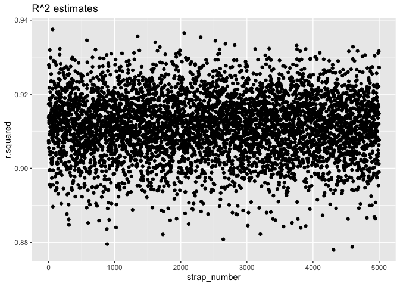
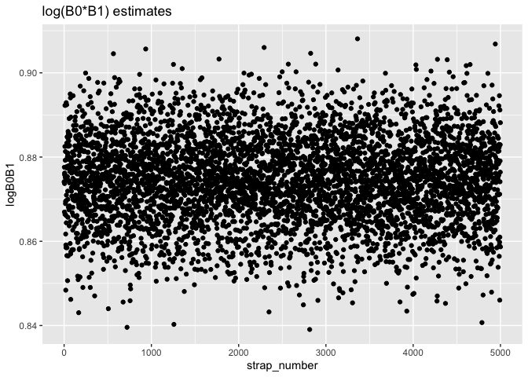

P8105 Homework 6 \[td2704\]
================

## Problem 1

``` r
birthweight_df = read_csv('data/birthweight.csv')
```

    ## Rows: 4342 Columns: 20

    ## ── Column specification ────────────────────────────────────────────────────────
    ## Delimiter: ","
    ## dbl (20): babysex, bhead, blength, bwt, delwt, fincome, frace, gaweeks, malf...

    ## 
    ## ℹ Use `spec()` to retrieve the full column specification for this data.
    ## ℹ Specify the column types or set `show_col_types = FALSE` to quiet this message.

``` r
birthweight_data = 
  birthweight_df %>%
  janitor::clean_names()  %>%
  mutate(
    babysex = as.factor(babysex),
    babysex = fct_recode(babysex, "male" = "1", "female" = "2"),
    frace = as.factor(frace),
    frace = fct_recode(frace, "white" = "1", "black" = "2", 
                       "asian" = "3", "puerto_rican" = "4",
                       "other" = "8"), # "unknown" = "9"
    mrace = as.factor(mrace),
    mrace = fct_recode(mrace, "white" = "1", "black" = "2", 
                       "asian" = "3", "puerto_rican" = "4"), # "other" = "8"
    # malform = as.factor(malform),
    # malform = fct_recode(malform, "absent" = "0", "present" = "1")
    malform = as.logical(malform)
  )

birthweight_data
```

    ## # A tibble: 4,342 × 20
    ##    babysex bhead blength   bwt delwt fincome frace gaweeks malform menarche
    ##    <fct>   <dbl>   <dbl> <dbl> <dbl>   <dbl> <fct>   <dbl> <lgl>      <dbl>
    ##  1 female     34      51  3629   177      35 white    39.9 FALSE         13
    ##  2 male       34      48  3062   156      65 black    25.9 FALSE         14
    ##  3 female     36      50  3345   148      85 white    39.9 FALSE         12
    ##  4 male       34      52  3062   157      55 white    40   FALSE         14
    ##  5 female     34      52  3374   156       5 white    41.6 FALSE         13
    ##  6 male       33      52  3374   129      55 white    40.7 FALSE         12
    ##  7 female     33      46  2523   126      96 black    40.3 FALSE         14
    ##  8 female     33      49  2778   140       5 white    37.4 FALSE         12
    ##  9 male       36      52  3515   146      85 white    40.3 FALSE         11
    ## 10 male       33      50  3459   169      75 black    40.7 FALSE         12
    ## # … with 4,332 more rows, and 10 more variables: mheight <dbl>, momage <dbl>,
    ## #   mrace <fct>, parity <dbl>, pnumlbw <dbl>, pnumsga <dbl>, ppbmi <dbl>,
    ## #   ppwt <dbl>, smoken <dbl>, wtgain <dbl>

Above, birthweight\_data is a cleaned version of the original data with
columns babysex, frace, and mrace turned into factors and column malform
turned into a logical (“absent” = “0”/FALSE, “present” = “1”/TRUE).

``` r
colnames(birthweight_data)[colSums(is.na(birthweight_data)) > 0] 
```

    ## character(0)

This line above shows that none of the columns have missing values.

Propose a regression model for birthweight.

My hypothesized structure for the factors that underly birthweight:  
babysex - difference in average birthweight by sex,  
blength - larger length = larger birthweight,  
fincome - higher income = healthier food = larger birthweight,  
malform - weight-related malformations,  
wtgain - mother’s weight gain could be correlated,  
gaweeks - gestational age could be correlated

So my linear model will take into account these factors as individual
variables to see which variables have the highest correlation.

``` r
fit = lm(bwt ~ babysex + blength + fincome + malform + wtgain + gaweeks, data = birthweight_data)

fit %>% 
  broom::tidy()
```

    ## # A tibble: 7 × 5
    ##   term          estimate std.error statistic  p.value
    ##   <chr>            <dbl>     <dbl>     <dbl>    <dbl>
    ## 1 (Intercept)   -4215.      97.4     -43.3   0       
    ## 2 babysexfemale   -15.2     10.0      -1.52  1.30e- 1
    ## 3 blength         124.       1.99     62.6   0       
    ## 4 fincome           1.73     0.192     8.98  3.79e-19
    ## 5 malformTRUE      46.8     84.6       0.553 5.80e- 1
    ## 6 wtgain            4.64     0.464    10.0   2.83e-23
    ## 7 gaweeks          24.5      1.70     14.4   7.76e-46

Show a plot of model residuals against fitted values – use
add\_predictions and add\_residuals in making this plot.

``` r
birthweight_data %>%
  modelr::add_predictions(fit) %>%
  modelr::add_residuals(fit) %>%
  ggplot(aes(x = pred, y = resid)) + geom_point() +
  ggtitle("Model residuals vs fitted values of birthweight")
```

<!-- -->

Let’s compare the above model to the following:  
(1) One using length at birth and gestational age as predictors (main
effects only).  
(2) One using head circumference, length, sex, and all interactions
(including the three-way interaction) between these.

Create cross validation pairs dataframes.

``` r
cv_df =
  crossv_mc(birthweight_data, 100) %>% 
  mutate(
    train = map(train, as_tibble),
    test = map(test, as_tibble))
```

Now, we fit to train data and get prediction errors (RMSE) for the test
data.

``` r
cv_df = 
  cv_df %>% 
  mutate(
    my_mod = map(train, ~lm(bwt ~ babysex + blength + fincome + malform + wtgain + gaweeks, data = .x)),
    suggested_mod1 = map(train, ~lm(bwt ~ blength + gaweeks, data = .x)),
    suggested_mod2 = map(train, ~lm(bwt ~ bhead + blength + babysex + bhead*blength + bhead*babysex + blength*babysex + bhead*blength*babysex, data = .x))) %>% 
  mutate(
    rmse_my = map2_dbl(my_mod, test, ~rmse(model = .x, data = .y)),
    rmse_suggested1 = map2_dbl(suggested_mod1, test, ~rmse(model = .x, data = .y)),
    rmse_suggested2 = map2_dbl(suggested_mod2, test, ~rmse(model = .x, data = .y)))
```

Now we plot RMSE prediction errors across all 3 models to compare.

``` r
cv_df %>% 
  select(starts_with("rmse")) %>% 
  pivot_longer(
    everything(),
    names_to = "model", 
    values_to = "rmse",
    names_prefix = "rmse_") %>% 
  mutate(model = fct_inorder(model)) %>% 
  ggplot(aes(x = model, y = rmse)) + geom_violin() +
  ggtitle("RMSE Prediction Errors vs Model")
```

<!-- -->

The above plot shows RMSE prediction errors on the test data for each of
the three models:  
“my” = babysex, blength, fincome, malform, wtgain, gaweeks (my
hypothesized model, main effects only)  
“suggested1” = length at birth and gestational age as predictors (main
effects only)  
“suggested2” = head circumference, length, sex, and all interactions
(including the three-way interaction) between these

As we can see from the plot above, the second suggested model with all
interactions of head circumference, length, and sex had the lowest
prediction error. My hypothesized model has slightly lower error than
the first suggested model, but the second suggested model seems to be
the best model among the three for predicting birthweight.

## Problem 2

First load the data.

``` r
weather_df = 
  rnoaa::meteo_pull_monitors(
    c("USW00094728"),
    var = c("PRCP", "TMIN", "TMAX"), 
    date_min = "2017-01-01",
    date_max = "2017-12-31") %>%
  mutate(
    name = recode(id, USW00094728 = "CentralPark_NY"),
    tmin = tmin / 10,
    tmax = tmax / 10) %>%
  select(name, id, everything())
```

    ## Registered S3 method overwritten by 'hoardr':
    ##   method           from
    ##   print.cache_info httr

    ## using cached file: ~/Library/Caches/R/noaa_ghcnd/USW00094728.dly

    ## date created (size, mb): 2021-10-05 10:29:43 (7.602)

    ## file min/max dates: 1869-01-01 / 2021-10-31

``` r
weather_df
```

    ## # A tibble: 365 × 6
    ##    name           id          date        prcp  tmax  tmin
    ##    <chr>          <chr>       <date>     <dbl> <dbl> <dbl>
    ##  1 CentralPark_NY USW00094728 2017-01-01     0   8.9   4.4
    ##  2 CentralPark_NY USW00094728 2017-01-02    53   5     2.8
    ##  3 CentralPark_NY USW00094728 2017-01-03   147   6.1   3.9
    ##  4 CentralPark_NY USW00094728 2017-01-04     0  11.1   1.1
    ##  5 CentralPark_NY USW00094728 2017-01-05     0   1.1  -2.7
    ##  6 CentralPark_NY USW00094728 2017-01-06    13   0.6  -3.8
    ##  7 CentralPark_NY USW00094728 2017-01-07    81  -3.2  -6.6
    ##  8 CentralPark_NY USW00094728 2017-01-08     0  -3.8  -8.8
    ##  9 CentralPark_NY USW00094728 2017-01-09     0  -4.9  -9.9
    ## 10 CentralPark_NY USW00094728 2017-01-10     0   7.8  -6  
    ## # … with 355 more rows

Write the boot\_sample function to randomly sample with replacement as
done in class.

``` r
boot_sample = function(df) {
  sample_frac(df, replace = TRUE)
}
```

Apply this function to weather\_df for 5000 samples.

``` r
boot_straps = 
  data_frame(
    strap_number = 1:5000,
    strap_sample = rerun(5000, boot_sample(weather_df))
  )
```

    ## Warning: `data_frame()` was deprecated in tibble 1.1.0.
    ## Please use `tibble()` instead.
    ## This warning is displayed once every 8 hours.
    ## Call `lifecycle::last_warnings()` to see where this warning was generated.

``` r
boot_straps
```

    ## # A tibble: 5,000 × 2
    ##    strap_number strap_sample      
    ##           <int> <list>            
    ##  1            1 <tibble [365 × 6]>
    ##  2            2 <tibble [365 × 6]>
    ##  3            3 <tibble [365 × 6]>
    ##  4            4 <tibble [365 × 6]>
    ##  5            5 <tibble [365 × 6]>
    ##  6            6 <tibble [365 × 6]>
    ##  7            7 <tibble [365 × 6]>
    ##  8            8 <tibble [365 × 6]>
    ##  9            9 <tibble [365 × 6]>
    ## 10           10 <tibble [365 × 6]>
    ## # … with 4,990 more rows

Get estimates for BO (intercept), B1 (tmin coefficient), and R.squared.

``` r
bootstrap_results = 
  boot_straps %>% 
  mutate(
    models = map(strap_sample, ~lm(tmax ~ tmin, data = .x) ),
    results = map(models, broom::tidy)) %>% 
  select(-strap_sample, -models) %>% 
  unnest(results) 

bootstrap_results
```

    ## # A tibble: 10,000 × 6
    ##    strap_number term        estimate std.error statistic   p.value
    ##           <int> <chr>          <dbl>     <dbl>     <dbl>     <dbl>
    ##  1            1 (Intercept)     6.96    0.222       31.4 1.87e-105
    ##  2            1 tmin            1.06    0.0168      63.2 6.56e-198
    ##  3            2 (Intercept)     7.26    0.222       32.7 3.59e-110
    ##  4            2 tmin            1.03    0.0169      61.2 2.76e-193
    ##  5            3 (Intercept)     7.61    0.221       34.5 1.59e-116
    ##  6            3 tmin            1.01    0.0161      62.8 4.72e-197
    ##  7            4 (Intercept)     7.41    0.233       31.7 1.06e-106
    ##  8            4 tmin            1.05    0.0184      57.3 6.50e-184
    ##  9            5 (Intercept)     7.01    0.213       33.0 3.33e-111
    ## 10            5 tmin            1.05    0.0163      64.5 6.81e-201
    ## # … with 9,990 more rows

``` r
bootstrap_results2 = 
  boot_straps %>% 
  mutate(
    models = map(strap_sample, ~lm(tmax ~ tmin, data = .x) ),
    results = map(models, broom::glance)) %>% 
  select(-strap_sample, -models) %>% 
  unnest(results) 

bootstrap_results2
```

    ## # A tibble: 5,000 × 13
    ##    strap_number r.squared adj.r.squared sigma statistic   p.value    df logLik
    ##           <int>     <dbl>         <dbl> <dbl>     <dbl>     <dbl> <dbl>  <dbl>
    ##  1            1     0.917         0.916  2.86     3990. 6.56e-198     1  -900.
    ##  2            2     0.912         0.911  3.06     3742. 2.76e-193     1  -925.
    ##  3            3     0.916         0.915  2.75     3943. 4.72e-197     1  -886.
    ##  4            4     0.900         0.900  3.04     3282. 6.50e-184     1  -922.
    ##  5            5     0.920         0.919  2.86     4158. 6.81e-201     1  -900.
    ##  6            6     0.905         0.905  2.92     3455. 1.45e-187     1  -909.
    ##  7            7     0.903         0.903  3.07     3397. 2.34e-186     1  -926.
    ##  8            8     0.913         0.912  2.94     3792. 3.17e-194     1  -910.
    ##  9            9     0.916         0.916  2.95     3956. 2.77e-197     1  -912.
    ## 10           10     0.906         0.906  2.95     3491. 2.70e-188     1  -911.
    ## # … with 4,990 more rows, and 5 more variables: AIC <dbl>, BIC <dbl>,
    ## #   deviance <dbl>, df.residual <int>, nobs <int>

Plot the distribution of your estimates, and describe these in words.

``` r
bootstrap_results2 %>%
  ggplot(aes(x=strap_number,y=r.squared)) +
  geom_point() +
  ggtitle("R^2 estimates")
```

<!-- -->

``` r
bootstrap_results2 %>%
  ggplot(aes(x=r.squared)) +
  geom_histogram() +
  ggtitle("R^2 estimates")
```

    ## `stat_bin()` using `bins = 30`. Pick better value with `binwidth`.

<!-- -->

From the plots above, we can see that R^2 seems to be normally
distributed around 0.91/0.915.

``` r
bootstrap_results %>% 
  select(strap_number, term, estimate) %>%
  pivot_wider(
    names_from = term,
    values_from = estimate
  ) %>%
  rename("B0" = "(Intercept)") %>%
  rename("B1" = "tmin") %>%
  mutate(
    logB0B1 = log(B0*B1)
  ) %>%
  ggplot(aes(x=strap_number,y=logB0B1)) +
  geom_point() +
  ggtitle("log(B0*B1) estimates")
```

<!-- -->

``` r
bootstrap_results %>% 
  select(strap_number, term, estimate) %>%
  pivot_wider(
    names_from = term,
    values_from = estimate
  ) %>%
  rename("B0" = "(Intercept)") %>%
  rename("B1" = "tmin") %>%
  mutate(
    logB0B1 = log(B0*B1)
  ) %>%
  ggplot(aes(x=logB0B1)) +
  geom_histogram() +
  ggtitle("log(B0*B1) estimates")
```

    ## `stat_bin()` using `bins = 30`. Pick better value with `binwidth`.

<!-- -->

From the plots above, we can see that log(B0\*B1) seems to be normally
distributed around 2.01.

Identify the 2.5% and 97.5% quantiles to provide a 95% confidence
interval.

R.squared confidence interval:

``` r
bootstrap_results2 %>% 
  summarize(
    ci_lower = quantile(r.squared, 0.025), 
    ci_upper = quantile(r.squared, 0.975)) %>%
  knitr::kable()
```

| ci\_lower | ci\_upper |
|----------:|----------:|
|  0.893662 | 0.9273659 |

log(B0\*B1) confidence interval:

``` r
bootstrap_results %>% 
  select(strap_number, term, estimate) %>%
  pivot_wider(
    names_from = term,
    values_from = estimate
  ) %>%
  rename("B0" = "(Intercept)") %>%
  rename("B1" = "tmin") %>%
  mutate(
    logB0B1 = log(B0*B1)
  ) %>%
  summarize(
    ci_lower = quantile(logB0B1, 0.025), 
    ci_upper = quantile(logB0B1, 0.975)) %>%
  knitr::kable()
```

| ci\_lower | ci\_upper |
|----------:|----------:|
|  1.963514 |  2.059966 |
