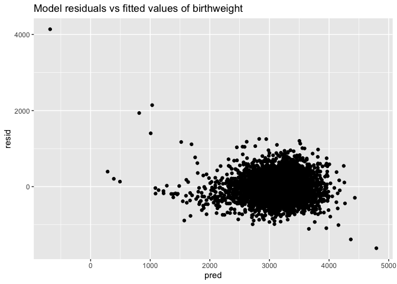

P8105 Homework 6 \[td2704\]
================

## Problem 1

``` r
birthweight_df = read_csv('data/birthweight.csv')
```

    ## Rows: 4342 Columns: 20

    ## ── Column specification ────────────────────────────────────────────────────────
    ## Delimiter: ","
    ## dbl (20): babysex, bhead, blength, bwt, delwt, fincome, frace, gaweeks, malf...

    ## 
    ## ℹ Use `spec()` to retrieve the full column specification for this data.
    ## ℹ Specify the column types or set `show_col_types = FALSE` to quiet this message.

``` r
birthweight_data = 
  birthweight_df %>%
  janitor::clean_names()  %>%
  mutate(
    babysex = as.factor(babysex),
    babysex = fct_recode(babysex, "male" = "1", "female" = "2"),
    frace = as.factor(frace),
    frace = fct_recode(frace, "white" = "1", "black" = "2", 
                       "asian" = "3", "puerto_rican" = "4",
                       "other" = "8"), # "unknown" = "9"
    mrace = as.factor(mrace),
    mrace = fct_recode(mrace, "white" = "1", "black" = "2", 
                       "asian" = "3", "puerto_rican" = "4"), # "other" = "8"
    # malform = as.factor(malform),
    # malform = fct_recode(malform, "absent" = "0", "present" = "1")
    malform = as.logical(malform)
  )

birthweight_data
```

    ## # A tibble: 4,342 × 20
    ##    babysex bhead blength   bwt delwt fincome frace gaweeks malform menarche
    ##    <fct>   <dbl>   <dbl> <dbl> <dbl>   <dbl> <fct>   <dbl> <lgl>      <dbl>
    ##  1 female     34      51  3629   177      35 white    39.9 FALSE         13
    ##  2 male       34      48  3062   156      65 black    25.9 FALSE         14
    ##  3 female     36      50  3345   148      85 white    39.9 FALSE         12
    ##  4 male       34      52  3062   157      55 white    40   FALSE         14
    ##  5 female     34      52  3374   156       5 white    41.6 FALSE         13
    ##  6 male       33      52  3374   129      55 white    40.7 FALSE         12
    ##  7 female     33      46  2523   126      96 black    40.3 FALSE         14
    ##  8 female     33      49  2778   140       5 white    37.4 FALSE         12
    ##  9 male       36      52  3515   146      85 white    40.3 FALSE         11
    ## 10 male       33      50  3459   169      75 black    40.7 FALSE         12
    ## # … with 4,332 more rows, and 10 more variables: mheight <dbl>, momage <dbl>,
    ## #   mrace <fct>, parity <dbl>, pnumlbw <dbl>, pnumsga <dbl>, ppbmi <dbl>,
    ## #   ppwt <dbl>, smoken <dbl>, wtgain <dbl>

Above, birthweight\_data is a cleaned version of the original data with
columns babysex, frace, and mrace turned into factors and column malform
turned into a logical (“absent” = “0”/FALSE, “present” = “1”/TRUE).

``` r
colnames(birthweight_data)[colSums(is.na(birthweight_data)) > 0] 
```

    ## character(0)

This line above shows that none of the columns have missing values.

Propose a regression model for birthweight.

My hypothesized structure for the factors that underly birthweight:  
babysex - difference in average birthweight by sex,  
blength - larger length = larger birthweight,  
fincome - higher income = healthier food = larger birthweight,  
malform - weight-related malformations,  
wtgain - mother’s weight gain could be correlated,  
gaweeks - gestational age could be correlated

So my linear model will take into account these factors as individual
variables to see which variables have the highest correlation.

``` r
fit = lm(bwt ~ babysex + blength + fincome + malform + wtgain + gaweeks, data = birthweight_data)

fit %>% 
  broom::tidy()
```

    ## # A tibble: 7 × 5
    ##   term          estimate std.error statistic  p.value
    ##   <chr>            <dbl>     <dbl>     <dbl>    <dbl>
    ## 1 (Intercept)   -4215.      97.4     -43.3   0       
    ## 2 babysexfemale   -15.2     10.0      -1.52  1.30e- 1
    ## 3 blength         124.       1.99     62.6   0       
    ## 4 fincome           1.73     0.192     8.98  3.79e-19
    ## 5 malformTRUE      46.8     84.6       0.553 5.80e- 1
    ## 6 wtgain            4.64     0.464    10.0   2.83e-23
    ## 7 gaweeks          24.5      1.70     14.4   7.76e-46

Show a plot of model residuals against fitted values – use
add\_predictions and add\_residuals in making this plot.

``` r
birthweight_data %>%
  modelr::add_predictions(fit) %>%
  modelr::add_residuals(fit) %>%
  ggplot(aes(x = pred, y = resid)) + geom_point() +
  ggtitle("Model residuals vs fitted values of birthweight")
```

<!-- -->

Let’s compare the above model to the following:  
(1) One using length at birth and gestational age as predictors (main
effects only).  
(2) One using head circumference, length, sex, and all interactions
(including the three-way interaction) between these.

Model (1) One using length at birth and gestational age as predictors
(main effects only):
